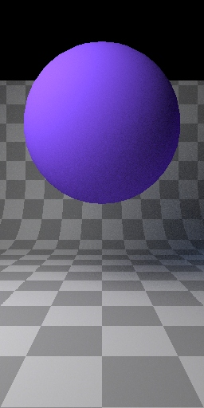

# Corona v5 stanalone material preview bug

Script demonstrate material preview bug with standalone Corona renderer v5
from the kit for 3ds max by generating few images with different size
where the sphere is shifted up.

